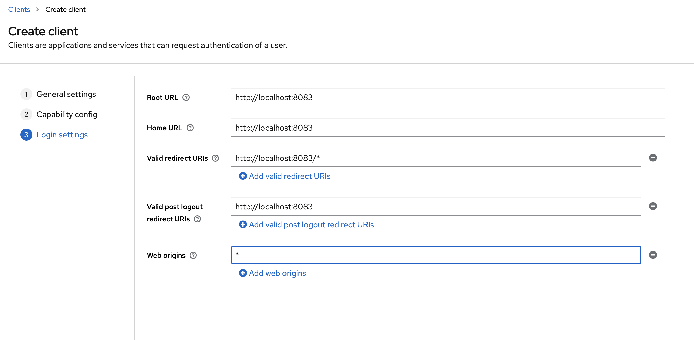

<!-- TABLE OF CONTENTS -->
<details open="open">
  <summary><h2 style="display: inline-block">Table of Contents</h2></summary>
  <ol>
    <li>
      <a href="#summary">Summary</a>
      <ul>
        <li><a href="#services">Services</a></li>
        <li><a href="#features">Features</a></li>
      </ul>
    </li>
    <li>
      <a href="#getting-started">Getting Started</a>
      <ul>
        <li><a href="#prerequisites">Prerequisites</a></li>
        <li><a href="#installation">Installation</a></li>
      </ul>
    </li>
    <li><a href="#contributing">Contributing</a></li>
    <li><a href="#contact">Contact</a></li>
    <li><a href="#References">References</a></li>
  </ol>
</details>


<!-- SUMMARY -->

## Summary

`api-gateway-service` project established by combination of the following services and features.

### Services

   ```
    * api-gateway
    * payment-service
    * student-service
    * swagger-application
    * openai-service
   ```

### Features

   ```
    * Spring Cloud Gateway
    * SpringDoc Swagger
    * Event Driven Architecture with RabbitMQ
    * Sleuth and Zipkin dependencies to track the logs
    * Postman collection to test by using Postman
    * Keycloak integration is completed under the payment-service
    * Feign Client secure call with Keycloak integration is completed under the student-service
    * MDC was added to improve logging between microservices
    * Google reCAPTCHA was added to secure endpoint calls
    * HCaptcha repo migration is completed under the student-service
    * openai-service repo migration is completed
   ```

<!-- GETTING STARTED -->

## Getting Started

To get a local copy up and running please follow these simple steps.

### Prerequisites

Followings should be installed and links for how to install them.

* Java 21 or higher [How to install Java](https://java.com/en/download/help/download_options.html)
    * Set `JAVA_HOME` to 21 -> `export JAVA_HOME=$(/usr/libexec/java_home -v 21)`
* Maven [How to install Maven](https://maven.apache.org/install.html)
* Docker [How to install Docker](https://docs.docker.com/get-docker)

* Run `docker-compose up -d` command in the [docker-compose.yml](docker-compose.yml) directory to install RabbitMQ,
  PostgreSQL and Keycloak -> `docker-compose up -d`

* Log in to http://localhost:9090/admin with `username: admin` and `password: admin`
    1. Create new realm. New realm name should be `payment-service`
    2. Create new client. New client name should be `payment-service`
    3. The other details should be like the following
        * 

* Google reCAPTCHA installation (OPTIONAL)
    * Log in to the https://www.google.com/recaptcha/admin/create
    * Fill the necessary fields.
        * [This url](https://examples.javacodegeeks.com/wp-content/uploads/2020/12/springboot-google-captcha-google-config-img1.jpg)
          can guide you
    * Copy SITE KEY and SECRET KEY and add them into related fields that are in
      the [application.yml](api-gateway%2Fsrc%2Fmain%2Fresources%2Fapplication.yml)
    * HCaptcha integration was implemented in 4 different ways
      in [HCaptchaController.java](student-service%2Fsrc%2Fmain%2Fjava%2Fcom%2Fmb%2Fstudentservice%2Fapi%2Fcontroller%2FHCaptchaController.java) (
      OPTIONAL)

* [Postman](https://www.postman.com/downloads/) can be installed (OPTIONAL)
    * If Postman is installed, import files that are under the [postman_collection](postman_collection) folder
    * How to import postman
      collection -> https://learning.postman.com/docs/getting-started/importing-and-exporting-data/#importing-postman-data

* Create new secret key and replace all YOUR_API_KEY_HERE in code with this new
  key -> https://platform.openai.com/account/api-keys

### Installation

1. Clone the repo
   ```sh
    git clone https://github.com/musabbozkurt/api-gateway-service.git
   ```
2. Run Spring Boot applications

    1. `mvn clean install` or `mvn clean package`
    2. `mvn spring-boot:run`

3. Additional information to access endpoints, swagger and actuator

    * Swagger: http://localhost:8080/swagger-ui/ or http://localhost:8080/swagger-ui/index.html
      or http://localhost:8080/swagger-ui.html
    * Actuator: http://localhost:8080/actuator

4. How to run in Docker
   ```sh
    1 - Open Docker Quickstart Terminal
    2 - Go to the project directory from Docker Quickstart Terminal
    3 - Create Docker image by typing the following command -> docker build -t api-gateway-service-project.jar
    4 - Type the following command to make sure docker image has been created -> docker image ls
    5 - Type the following command to run docker image -> docker run -p 9090:8080 api-gateway-service-project.jar
   ```

<!-- CONTRIBUTING -->

## Contributing

Contributions are what make the open source community such an amazing place to learn, inspire, and create. Any
contributions you make are **greatly appreciated**.

1. Fork the Project
2. Create your Feature Branch (`git checkout -b feature/amazing-feature`)
3. Commit your Changes (`git commit -m 'Add some amazing features'`)
4. Push to the Branch (`git push origin feature/amazing-feature`)
5. Open a Pull Request

<!-- CONTACT -->

## Contact

* Musab Bozkurt - [Linkedin](https://tr.linkedin.com/in/musab-bozkurt-24924986)

* Project
  Link: [https://github.com/musabbozkurt/api-gateway-service.git](https://github.com/musabbozkurt/api-gateway-service.git)

<!-- REFERENCES -->

### References

* Keycloak integration with Spring Boot Project
    - https://www.keycloak.org/getting-started/getting-started-docker
    - [Spring boot 3 Keycloak integration for beginners | The complete Guide](https://www.youtube.com/watch?v=vmEWywGzWbA)
    - https://www.keycloak.org/docs/latest/securing_apps/#_spring_boot_adapter
    - https://www.youtube.com/watch?v=rcvAmBoDlLk
    - Keycloak installation -> https://gruchalski.com/posts/2020-09-03-keycloak-with-docker-compose/
    - https://www.keycloak.org/docs/latest/server_admin/#_service_accounts
    - https://huongdanjava.com/get-access-token-using-the-grant-type-resource-owner-password-credentials-of-oauth-2-0-from-keycloak.html
    - https://developers.redhat.com/blog/2020/11/24/authentication-and-authorization-using-the-keycloak-rest-api#
    - https://www.baeldung.com/postman-keycloak-endpoints
    - https://stackoverflow.com/a/49127022
    - https://www.programcreek.com/java-api-examples/?api=org.springframework.security.oauth2.client.registration.ClientRegistrationRepository
    - https://github.com/edwin/java-keycloak-integration

* https://www.baeldung.com/spring-cloud-feign-oauth-token
* https://www.codementor.io/@cristianrosu948/protecting-your-spring-boot-rest-endpoints-with-google-recaptcha-and-aop-pn7a88s7w
* https://www.baeldung.com/spring-security-registration-captcha
* https://examples.javacodegeeks.com/using-google-captcha-with-spring-boot-application/
* https://stackoverflow.com/a/44924353
* https://www.baeldung.com/swagger-2-documentation-for-spring-rest-api

* HCaptcha integration with Spring Boot Project
    - [HCaptcha Developer Guide documentation](https://docs.hcaptcha.com/)
    - [HCaptcha Test Keys](https://docs.hcaptcha.com/#integration-testing-test-keys)
    - [HCaptcha Java Example]( https://golb.hplar.ch/2020/05/hcaptcha.html)

* OpenAI integration with Spring Boot Project
    - [Create new secret key and replace all YOUR_API_KEY_HERE in code with this new key](https://platform.openai.com/account/api-keys)
    - [openai-test-requests.http](openai-service%2Fopenai-test-requests.http)

* API Gateway with Spring Cloud Gateway in Java
    * [Building an API Gateway in Java with Spring Cloud Gateway](https://www.youtube.com/watch?v=EKoq98KqvrI)
    * [Spring Cloud Gateway](https://docs.spring.io/spring-cloud-gateway/reference/index.html)

* Swagger(OpenAPI Specification 3) Integration with Spring Cloud Gateway
    * [Swagger(OpenAPI Specification 3) Integration with Spring Cloud Gateway — Part 2](https://medium.com/@pubuduc.14/swagger-openapi-specification-3-integration-with-spring-cloud-gateway-part-2-1d670d4ab69a)
