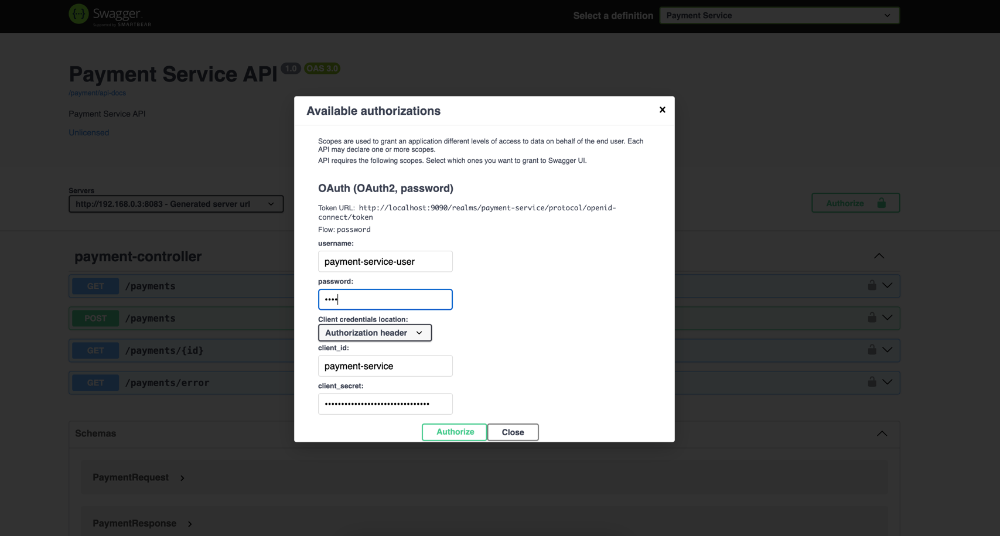

<!-- TABLE OF CONTENTS -->
<details open="open">
  <summary><h2 style="display: inline-block">Table of Contents</h2></summary>
  <ol>
    <li>
      <a href="#summary">Summary</a>
      <ul>
        <li><a href="#services">Services</a></li>
        <li><a href="#features">Features</a></li>
      </ul>
    </li>
    <li>
      <a href="#getting-started">Getting Started</a>
      <ul>
        <li><a href="#prerequisites">Prerequisites</a></li>
        <li><a href="#installation">Installation</a></li>
      </ul>
    </li>
    <li><a href="#references">References</a></li>
  </ol>
</details>

---

<!-- SUMMARY -->

## Summary

- `api-gateway-service` project established by combination of the following services and features

### Services

   ```
    * api-gateway
    * payment-service
    * student-service
    * swagger-application
    * openai-service
    * service-registry
   ```

### Features

   ```
    * Spring Cloud Gateway
    * SpringDoc Swagger
    * Event Driven Architecture with RabbitMQ
    * micrometer-tracing dependencies to track the logs
    * Postman collection to test by using Postman
    * Keycloak integration is completed under the payment-service
    * Feign Client secure call with Keycloak integration is completed under the student-service
    * MDC was added to improve logging between microservices
    * Google reCAPTCHA was added to secure endpoint calls
    * HCaptcha repo migration is completed under the student-service
    * openai-service repo migration is completed
    * Spring Cloud Eureka Server and Client integrations are completed with service-registry repo
    * KubernetesDeploymentGuide.md is added
   ```

---

<!-- GETTING STARTED -->

## Getting Started

- To get a local copy up and running please follow these steps

---

### Prerequisites

- Followings should be installed and links for how to install them
  ####
    * Java 21 or higher [How to install Java](https://java.com/en/download/help/download_options.html)
        * Set `JAVA_HOME` to 21 -> `export JAVA_HOME=$(/usr/libexec/java_home -v 21)`
    * Maven [How to install Maven](https://maven.apache.org/install.html)
    * Docker [How to install Docker](https://docs.docker.com/get-docker)
    * [Postman](https://www.postman.com/downloads/) can be installed (OPTIONAL),
      follow [how to import postman collection](https://learning.postman.com/docs/getting-started/importing-and-exporting-data/#importing-postman-data)
      to import files that are under the [postman_collection](docs%2Fpostman_collection) folder
  ####
    * Create a new secret key via [this url](https://platform.openai.com/account/api-keys), copy the value, and add it
      as `YOUR_API_KEY_HERE` value in the [.env](.env)
  ####
    * Google reCAPTCHA installation (OPTIONAL)
        * Log in to the https://www.google.com/recaptcha/admin/create
        * Fill the necessary fields.
            * [This url](https://examples.javacodegeeks.com/wp-content/uploads/2020/12/springboot-google-captcha-google-config-img1.jpg)
              can guide you
        * Copy `SITE_KEY` and `SECRET_KEY` and add them into related fields that are in the [.env](.env)
  ####
    * HCaptcha integration was implemented in 4 different ways
      in [HCaptchaController.java](student-service/src/main/java/com/mb/studentservice/api/controller/HCaptchaController.java)
      (OPTIONAL)

---

### Installation

1. Clone the repo
   ```sh
    git clone https://github.com/musabbozkurt/api-gateway-service.git
   ```

####

2. Run all services

    - (OPTION 1)
        - Run `docker-compose --profile start_application up -d --build` command in
          the [docker-compose.yml](docker-compose.yml) directory
    - (OPTION 2)
        1. Enable [spring.docker.compose](api-gateway/src/main/resources/application.yml) property and just
           run [ApiGatewayApplication.java](api-gateway/src/main/java/com/mb/apigateway/ApiGatewayApplication.java) to
           install RabbitMQ, PostgreSQL and Keycloak
        2. Run `mvn clean install` or `mvn clean package` command under each service's directory
        3. Run `mvn spring-boot:run` command under each service's directory

####

3. Log in to http://localhost:9090/admin with `username`: `admin` and `password`: `admin`
    1. `Create realm` --> Import [payment-service-realm-export.json](docs/keycloak/payment-service-realm-export.json)
    2. `Clients` --> `payment-service` --> `Credentials` --> `Regenerate` copy the value and add it as
       `PAYMENT_CLIENT_SECRET_ENV` value in the [.env](.env)
    3. `Users` --> `Add user` --> `Username` --> `payment-service-user`
    4. `Users` --> `payment-service-user` --> `Credentials` --> `Set password` to `test` and turn off `Temporary` toggle
    5. `Users` --> `payment-service-user` --> `Role Mapping` --> `Assign role` add `admin` role
    6. Restart `student-service` to fetch `PAYMENT_CLIENT_SECRET`

####

4. Additional information to access endpoints, swagger and actuator

    * Swagger: http://localhost:8080/swagger-ui.html
        * Open `Swagger` --> select `Payment Service` definition --> Click `Authorize`
            1. Enter the following credentials into the pop-up window
                1. `username`: `payment-service-user`
                2. `password`: `test`
                3. `client_id`: `payment-service`
                4. `client_secret`: `PAYMENT_CLIENT_SECRET_ENV` value in the [.env](.env)
            2. 
            3. Click `Authorize` to get token
            4. Click `Close` and test the services
    * Actuator: http://localhost:8080/actuator
    * Eureka: http://localhost:8761/

####

5. [Kubernetes Deployment Guide](KubernetesDeploymentGuide.md) (OPTIONAL)

---

<!-- REFERENCES -->

## References

* [References](References.md)

---
