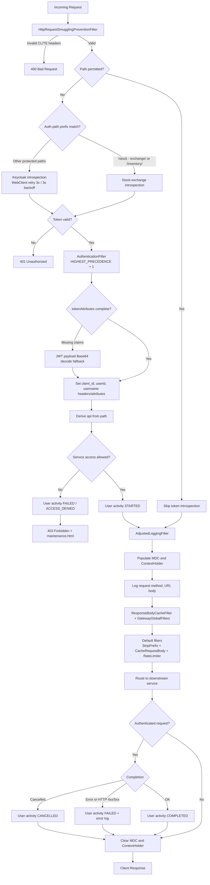

# API Gateway

## Description

API Gateway is the single entry point for all client requests in the microservice architecture. Built with **Spring
Cloud Gateway** (reactive/WebFlux), it routes traffic to downstream services, provides centralized security, rate
limiting, request/response logging, and aggregated Swagger documentation.

## Key Features

- **Dynamic Routing** — Routes requests to downstream services via Eureka service discovery (`lb://` URIs)
- **Path-Based Authentication** — Configurable `stock-exchange-auth-path-prefixes` routes token validation to
  stock-exchange-service's introspection endpoint for `/stock-exchange/` and `/inventory/` paths; all other paths use
  Keycloak introspection
- **Configurable Security** — Permitted paths externalized to `application.yml` via
  `gateway-service.security.permitted-paths` (no code changes needed to allow new endpoints)
- **Rate Limiting** — Redis-backed `RequestRateLimiter` filter (40 requests/sec replenish, 80 burst capacity)
- **Google reCAPTCHA** — AOP-based captcha validation with `@RequiresCaptcha` annotation
- **Request/Response Logging** — Global filters for logging request and response bodies with configurable max body size
- **HTTP Request Smuggling Prevention** — Dedicated filter to block smuggling attacks
- **Authentication Filter** — Gateway-level authentication with context propagation (null-safe header handling)
- **Centralized Swagger UI** — Aggregates OpenAPI docs from all downstream services at a single URL
- **Spring Cloud Eureka Client** — Registers with Eureka for service discovery
- **OpenTelemetry Observability** — OTLP export for metrics, traces, and logs to Grafana LGTM stack; Logback appender
  integration via `InstallOpenTelemetryAppender`
- **Micrometer Tracing** — Distributed tracing with Brave bridge and Zipkin export

## Tech Stack

- Java 26, Spring Boot 4.0, Spring Cloud Gateway
- Spring WebFlux (reactive)
- Redis (rate limiting)
- Spring Cloud Eureka Client
- SpringDoc OpenAPI (aggregated Swagger UI)
- Micrometer Tracing (Brave) + OpenTelemetry (OTLP)
- Grafana LGTM (Loki, Grafana, Tempo, Mimir)

## Configuration

| Property                                                     | Default                                              | Description                                                 |
|--------------------------------------------------------------|------------------------------------------------------|-------------------------------------------------------------|
| `server.port`                                                | `8080`                                               | Gateway port                                                |
| `spring.data.redis.host`                                     | `localhost`                                          | Redis host (env: `REDIS_HOST`)                              |
| `spring.data.redis.port`                                     | `6379`                                               | Redis port (env: `REDIS_PORT`)                              |
| `gateway-service.security.permitted-paths`                   | *(see application.yml)*                              | Paths accessible without authentication                     |
| `gateway-service.security.stock-exchange-auth-path-prefixes` | `/stock-exchange/`, `/inventory/`                    | Paths routed to stock-exchange-service token introspection  |
| `gateway-service.client-id`                                  | `api-gateway-client`                                 | OAuth2 client ID (env: `CLIENT_ID`)                         |
| `gateway-service.client-secret`                              | `gateway-secret`                                     | OAuth2 client secret (env: `CLIENT_SECRET`)                 |
| `secure-service.introspection-uri`                           | `localhost:8081/.../introspect`                      | Keycloak token introspection URI (env: `INTROSPECTION_URI`) |
| `stock-exchange-service.introspection-uri`                   | `lb://stock-exchange-service/api/v1/auth/introspect` | Stock-exchange token introspection URI                      |
| `google.recaptcha.*`                                         | Configured via `.env`                                | reCAPTCHA site/secret keys                                  |
| `eureka.client.*`                                            | `localhost:8761/eureka`                              | Eureka service registry                                     |
| `management.otlp.metrics.export.url`                         | `localhost:4318/v1/metrics`                          | OTLP metrics endpoint                                       |
| `management.opentelemetry.tracing.export.otlp.endpoint`      | `localhost:4318/v1/traces`                           | OTLP traces endpoint                                        |
| `management.opentelemetry.logging.export.otlp.endpoint`      | `localhost:4318/v1/logs`                             | OTLP logs endpoint                                          |

## Process Execution Order

1. **HTTP Request Smuggling Guard** — `HttpRequestSmugglingPreventionFilter` runs first and rejects malformed
   `Content-Length` / `Transfer-Encoding` combinations with `400 Bad Request`.
2. **Security Chain Evaluation** — `SecurityWebFilterChain` checks path rules:
    - **Permitted paths** (`gateway-service.security.permitted-paths`) continue without token introspection.
    - **Protected paths** require opaque token validation.
3. **Path-Based Token Introspection** — `authenticationManagerResolver()` selects introspection target:
    - `/stock-exchange/**` and `/inventory/**` (configurable prefixes) use
      `stock-exchange-service.introspection-uri`.
    - All other protected paths use `secure-service.introspection-uri` (Keycloak), with retry/backoff support.
4. **Authentication Result** — Invalid/expired token returns `401 Unauthorized`; valid token proceeds.
5. **Gateway Global Filters**:
    - `AuthenticationFilter` (`HIGHEST_PRECEDENCE + 1`) propagates `client_id`, `userId`, and `username` to
      headers/attributes (with JWT-claim fallback), derives `api` from the path, and performs service-level access
      checks (denied requests return `403` and a maintenance page). For granted access it emits user activity logs
      (`STARTED` / `COMPLETED` / `FAILED` / `CANCELLED`).
    - Logging filters (`LoggingFilter`, `AdjustedLoggingFilter`, `GatewayGlobalFilters`) populate MDC and
      `ContextHolder`, log request/response details, and clear context after the response.
    - `ResponseBodyCacheFilter` decorates non-streaming responses to inspect response bodies for configured error
      markers.
6. **Default Route Filters** — `StripPrefix=1`, `CacheRequestBody`, and Redis-backed `RequestRateLimiter` are applied.
7. **Routing** — Request is forwarded to the matching downstream `lb://` route.
8. **Response Return** — Response is sent back to the client through post-filter logging/context cleanup.

## Request Processing Flow



```
┌───────────────────────────────────────────────────────────────┐
│         Incoming Request (Bearer Token on protected paths)    │
└─────────────────────────────┬─────────────────────────────────┘
                              │
                    [1] HTTP Request Smuggling Guard
                              │
                              ▼
              ┌───────────────────────────────┐
              │ HttpRequestSmugglingPrevention│
              │ Filter                        │
              │ Order: HIGHEST_PRECEDENCE     │
              └───────────┬───────────────────┘
                          │
          ┌───────────────┴───────────────┐
          │                               │
     Invalid CL/TE                   Valid headers
          │                               │
          ▼                               ▼
   ┌─────────────┐            [2] SecurityWebFilterChain
   │ Return 400  │              Path-based security check
   └─────────────┘                        │
                                          ▼
                              [3] Path Evaluation
                                          │
                  ┌───────────────────────┴───────────────────────┐
                  │                                               │
             [3a] Permitted                                  [3b] Protected
                  │                                               │
                  ▼                                               ▼
        ┌──────────────────────┐                    ┌──────────────────────────┐
        │  Permitted Paths     │                    │   Protected Paths        │
        │  ✓ /actuator/health │                    │   Opaque token required  │
        │  ✓ /swagger-ui/**   │                    │                          │
        │  ✓ forgot-password  │                    └─────────┬────────────────┘
        └──────────┬───────────┘                              │
                   │                                 [4] Path-based introspection
                   │ Skip Auth                                │
                   │                      ┌───────────────────┴───────────────────┐
                   │                      │                                       │
                   │           /stock-exchange/ or /inventory/           Other protected paths
                   │                      │                                       │
                   │                      ▼                                       ▼
                   │         ┌────────────────────────┐            ┌──────────────────────────┐
                   │         │ Stock-exchange         │            │ Keycloak (SSO)           │
                   │         │ introspection          │            │ WebClient retry          │
                   │         │ lb://.../introspect    │            │ - Max retries: 3         │
                   │         └──────────┬─────────────┘            │ - Backoff: 3s            │
                   │                    │                          │ - Connection pooling     │
                   │                    │                          └────────────┬─────────────┘
                   │                    │                                       │
                   │                    └───────────────────┬───────────────────┘
                   │                                        │
                   │                            [5] Validation Result
                   │                                        │
                   │                    ┌───────────────────┴───────────────────┐
                   │                    │                                       │
                   │               [5a] Valid                              [5b] Invalid
                   │                    │                                       │
                   │                    ▼                                       ▼
                   │             ┌─────────────┐                       ┌─────────────────┐
                   │             │ Valid Token │                       │  Invalid Token  │
                   │             └──────┬──────┘                       └────────┬────────┘
                   │                    │                                       │
                   │                    │                               [6] Return Error
                   │                    │                                       │
                   │                    │                                       ▼
                   │                    │                              ┌────────────────┐
                   │                    │                              │   Return 401   │
                   │                    │                              └────────────────┘
                   │                    │
                   │        [7] AuthenticationFilter
                   │            Order: HIGHEST_PRECEDENCE + 1
                   │                    │
                   │                    ▼
                   │    ┌────────────────────────────────────────────────┐
                   │    │  [7.1] Extract claims                          │
                   │    │  ├─ tokenAttributes (introspection)            │
                   │    │  │   ├─ client_id                              │
                   │    │  │   ├─ userId                                 │
                   │    │  │   └─ username                               │
                   │    │  └─ If missing: JWT payload Base64 decode      │
                   │    │                                                │
                   │    │  [7.2] Set HTTP headers & exchange attributes  │
                   │    │  ├─ client_id                                  │
                   │    │  ├─ userId                                     │
                   │    │  └─ username                                   │
                   │    │                                                │
                   │    │  [7.3] Derive api from path                    │
                   │    │                                                │
                   │    │  [7.4] Service access check                    │
                   │    │  ├─ Denied: FAILED / ACCESS_DENIED → 403       │
                   │    │  │          + maintenance.html                 │
                   │    │  └─ Granted: user activity STARTED             │
                   │    └────────────────┬───────────────────────────────┘
                   │                     │
                   └─────────────────────┤
                                         │
                         [8] AdjustedLoggingFilter
                             Order: HIGHEST_PRECEDENCE + 1
                                         │
                                         ▼
                ┌────────────────────────────────────────────────┐
                │  [8.1] Populate MDC and ContextHolder          │
                │  ├─ client_id / username / api / session       │
                │                                                │
                │  [8.2] Log request details                     │
                │  ├─ Method / URI                               │
                │  ├─ Body (json / xml / form-urlencoded)        │
                │  └─ Status on error                            │
                │                                                │
                │  [8.3] Error handling                          │
                │  ├─ doOnError: log with context                │
                │  └─ After response: log if status is error     │
                │                                                │
                │  [8.4] ResponseBodyCacheFilter +               │
                │        GatewayGlobalFilters                    │
                │                                                │
                │  [8.5] Default filters                         │
                │  ├─ StripPrefix=1                              │
                │  ├─ CacheRequestBody                           │
                │  └─ RequestRateLimiter                         │
                └────────────────┬───────────────────────────────┘
                                 │
                             [9] Route
                                 │
                                 ▼
                ┌────────────────────────────────────────────────┐
                │  Route to downstream service (lb://)           │
                │  Headers propagated automatically              │
                └────────────────┬───────────────────────────────┘
                                 │
                [10] Completion (authenticated requests only)
                                 │
              ┌──────────────────┼──────────────────┐
              │                  │                  │
              ▼                  ▼                  ▼
        COMPLETED             FAILED           CANCELLED
              │                  │                  │
              └──────────────────┼──────────────────┘
                                 │
                [11] Clear MDC and ContextHolder
                                 │
                                 ▼
                         ┌───────────────┐
                         │   Response    │
                         └───────────────┘
```

## Routes

| Route                          | Path Prefix              | Target Service                      |
|--------------------------------|--------------------------|-------------------------------------|
| `brokerage-provider`           | `/brokerage-provider/**` | `lb://brokerage-provider`           |
| `gitlab-service`               | `/gitlab/**`             | `lb://gitlab-service`               |
| `inventory-management-service` | `/inventory/**`          | `lb://inventory-management-service` |
| `kafka-debezium-service`       | `/kafka-debezium/**`     | `lb://kafka-debezium-service`       |
| `notification-service`         | `/notification/**`       | `lb://notification-service`         |
| `openai-service`               | `/openai/**`             | `lb://openai-service`               |
| `payment-service`              | `/payment/**`            | `lb://payment-service`              |
| `student-service`              | `/student/**`            | `lb://student-service`              |
| `stock-exchange-service`       | `/stock-exchange/**`     | `lb://stock-exchange-service`       |
| `swagger-application`          | `/swagger/**`            | `lb://swagger-application`          |

## Running

```bash
./mvnw spring-boot:run
```

**URLs:**

- Gateway: `http://localhost:8080`
- Swagger UI: `http://localhost:8080/swagger-ui.html`
- Actuator: `http://localhost:8080/actuator`
